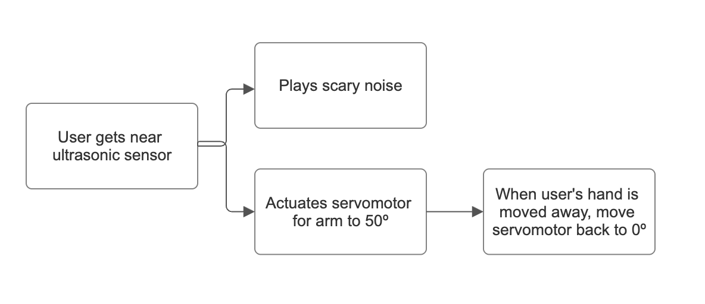
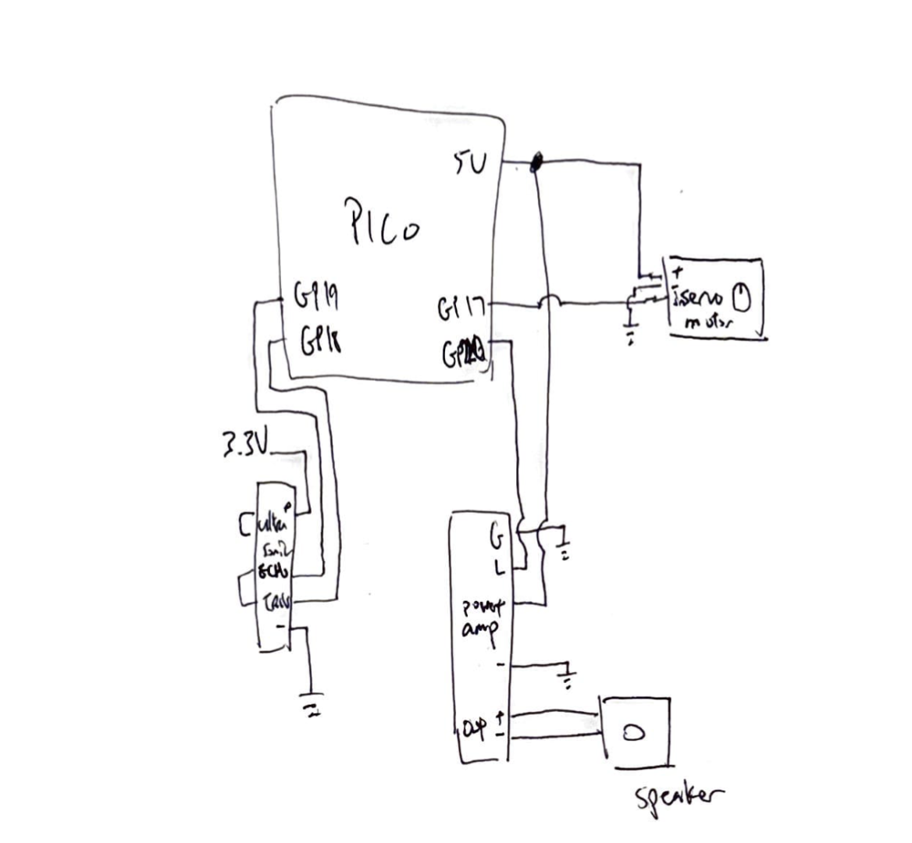

<h1 align="center">Isaac Chen's DSGN297 Final Project: Scary Spider</h1>

---

## Block Diagram and Circuit Diagram

<p align="center">
  <strong>Block Diagram</strong><br>
  
</p>

<p align="center">
  <strong>Circuit Diagram</strong><br>
  
</p>

---

## Source Code

```python
import time
import board
import adafruit_hcsr04
import audiocore
import audiopwmio
import pwmio

sonar = adafruit_hcsr04.HCSR04(trigger_pin=board.GP18, echo_pin=board.GP19)

sound1 = open("cash_register.wav", "rb")
wav1 = audiocore.WaveFile(sound1)
a = audiopwmio.PWMAudioOut(board.GP20)

servo = pwmio.PWMOut(board.GP17, variable_frequency=True)
servo.frequency = 50

def angle_to_duty(angle):
    min_pulse = 0.5e-3
    max_pulse = 2.5e-3
    period = 1.0 / 50.0 
    pulse = min_pulse + (angle / 180.0) * (max_pulse - min_pulse)
    return int(65535 * (pulse / period))

object_near = False

while True:
    try:
        distance = sonar.distance  # in cm
        print(f"Distance: {distance:.1f} cm")

        if distance < 15 and not object_near:
            object_near = True
            print("Object detected!")
            servo.duty_cycle = angle_to_duty(50)
            if not a.playing:
                a.play(wav1)

        elif distance >= 15 and object_near:
            object_near = False
            print("Object gone")
            servo.duty_cycle = angle_to_duty(0)

    except RuntimeError:
        print("Retrying...")

    time.sleep(0.05)
